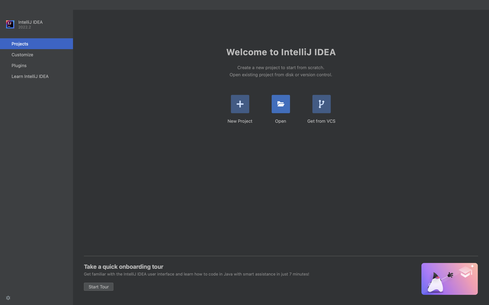
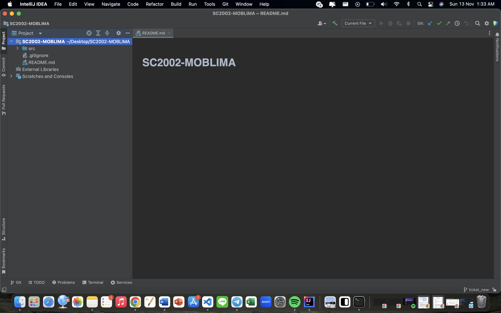
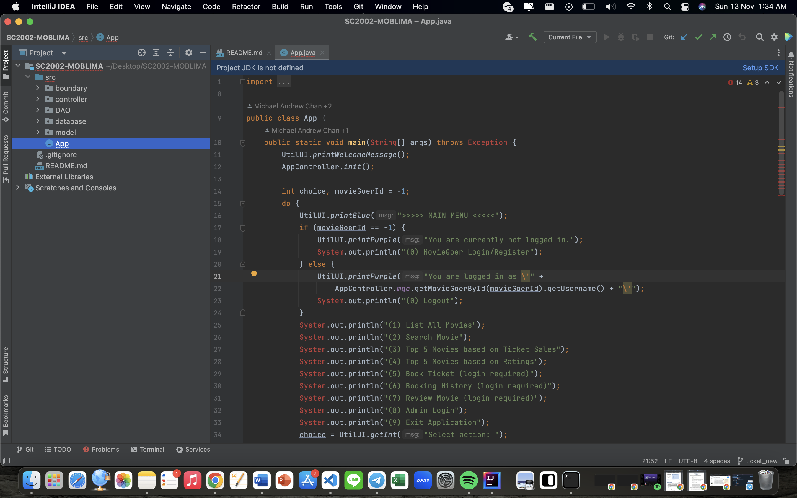

# SC2002-MOBLIMA (MOvie Booking and LIsting Management Application) AY22-S1

**_MOBLIMA_** is an application to computerize the processes of making online booking and purchase of movie tickets, listing of movies and sale reporting. It will be used by the moviegoers and cinema staff. This serves as a final project for this module and consists of 30% of our mark.
  
Our team member:  

- Elizabeth Koh Li Ying  
- Kristian Hadinata Achwan  
- Lai Mun Khoi Ivan  
- Michael Andrew Chan  

## Getting it up and running

For testing this project, we recommend you to use IntelliJ IDEA **_Community Edition_**. It can be downloaded <a href="https://www.jetbrains.com/idea/download">here</a>.
  
After successfully install IDEA, open IDEA and wait until it gets you here
 

 
 
Then, click open, and select the folder **_SC2002-MOBLIMA_** and click open.
 

 
 
Then, proceed to take a look at the **_Project Files_** to go find App.java. It is located in **_src/App.java_**
 

You have to set up JDK first in order to be able to run this project on your device. Click **_setup SDK below the tab of App.java_** and choose **_1.8 Open OracleJDK version 18.0.2_** (version used around October 2022). And Voila! Now you good to go! You can run your project by clicking green play icon on top and you can test the application.

Tutorial on how to use/test the application will be explained further in the report and video. Thank you.
